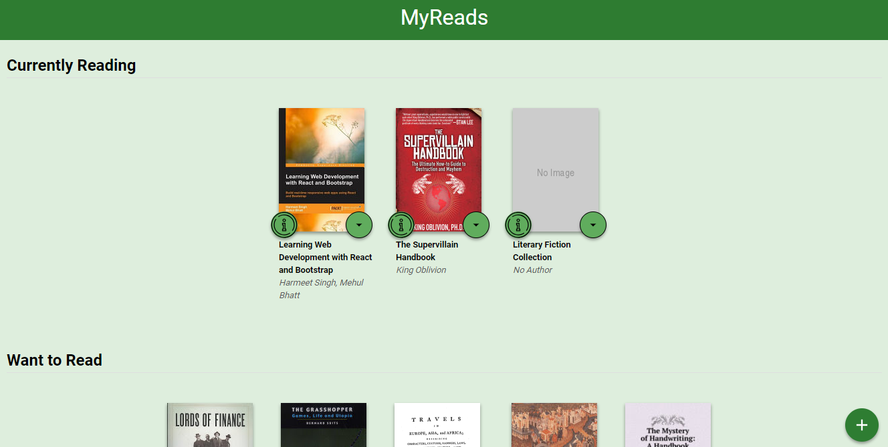

# MyReads Project

This reading app is created with ReactJS, and allows the user to find and select books from a library (in an api server), and place them on shelves entitled "Currently Reading", "Want to Read", and "Already Read".

## Requirements

- npm

## Installation

To get started : 
- [Download](https://github.com/dluteri/MyReads-Project) or [clone](https://github.com/dluteri/MyReads-Project) the repository
- Run `npm install`  to install the project dependencies
- Initiate the server with `npm start`
- App will appear in your local web browser at: `localhost:3000`

## Important
The backend API uses a fixed set of cached search results and is limited to a particular set of search terms, which can be found in [SEARCH_TERMS.md](SEARCH_TERMS.md). That list of terms are the _only_ terms that will work with the backend, so don't be surprised if your searches for Basket Weaving or Bubble Wrap don't come back with any results.

## Create React App

This project was bootstrapped with [Create React App](https://github.com/facebookincubator/create-react-app). You can find more information on how to perform common tasks [here](https://github.com/facebookincubator/create-react-app/blob/master/packages/react-scripts/template/README.md).

## Contributing

This repository was created from the starter code for _all_ Udacity students. Therefore, we most likely will not accept pull requests.

For details, check out [CONTRIBUTING.md](CONTRIBUTING.md).
# MyReads-Project
